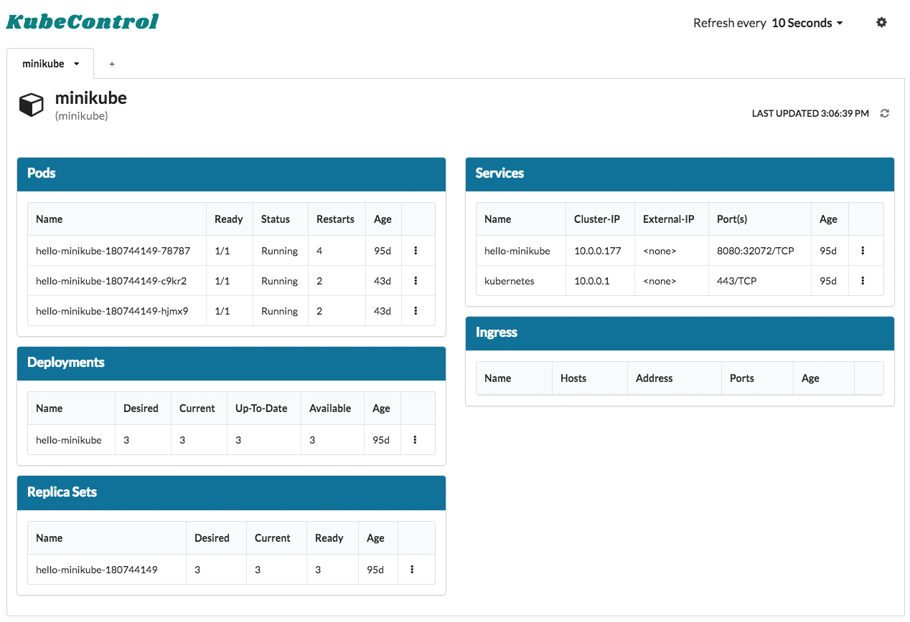

# KubeControl

---

**NOT CURRENTLY MAINTAINED** - If I have more free time in the future I'll be picking this up again. :)

---

Never look up a `kubectl` command again. KubeControl puts a user friendly GUI over your existing `kubectl` config.

[Download For Mac](http://www.matthaugen.com/kube_control/KubeControl_Mac.zip)

## Current Features
- View status of most commonly used resources
- View `Logs` and `Describe` of resources
- View your `kubectl` config

## Future Features
- View more resource types (Secrets, ConfigMaps, etc)
- Delete resources
- Apply changes to resources
- Manage kubectl config within KubeControl

## Built On
- Angular Electron (https://github.com/maximegris/angular-electron.git)
- Semantic UI (https://semantic-ui.com/)
- ng2-semantic-ui (https://github.com/edcarroll/ng2-semantic-ui)
